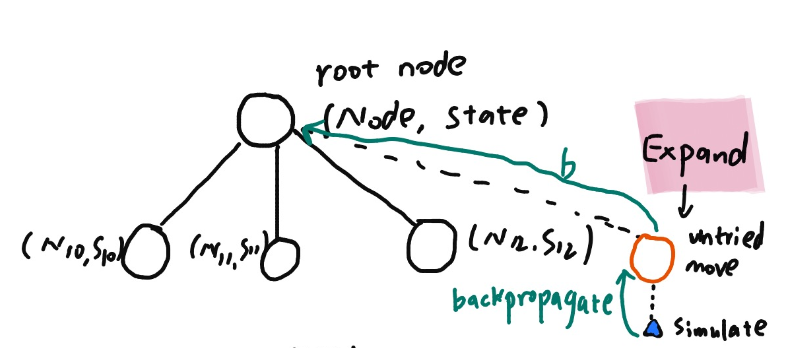
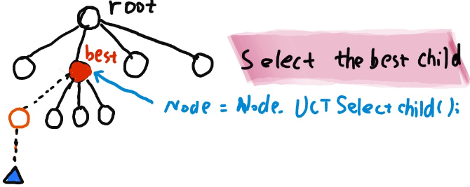
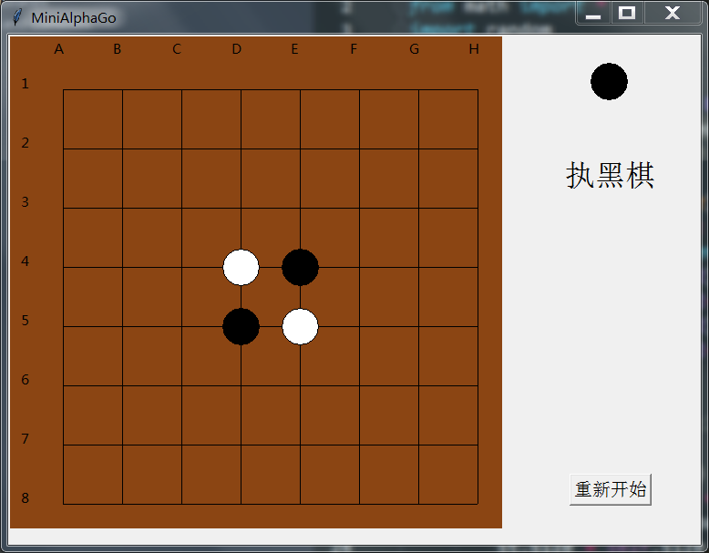
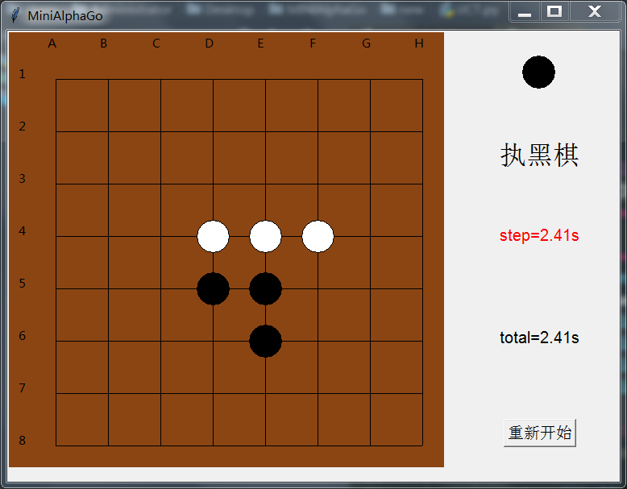
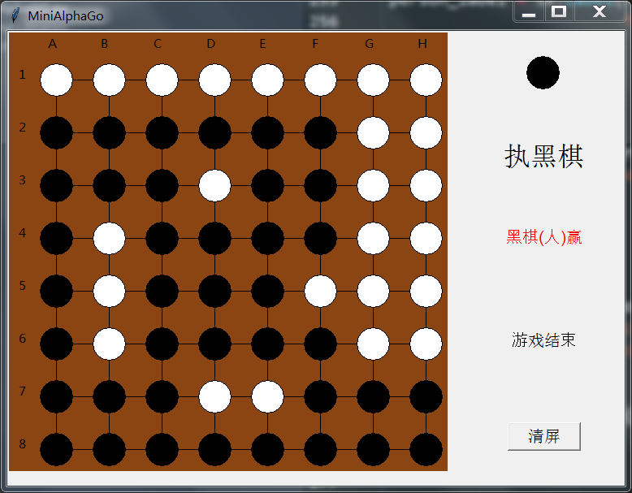

# Mini-AlphaGo
Python-GUI based on tkinter.

Algorithm: Monte Carlo Tree Search

This is my Artificial Intelligence class project coopeated with Chao Wang.

Select the Best Child

Expand

Demo

